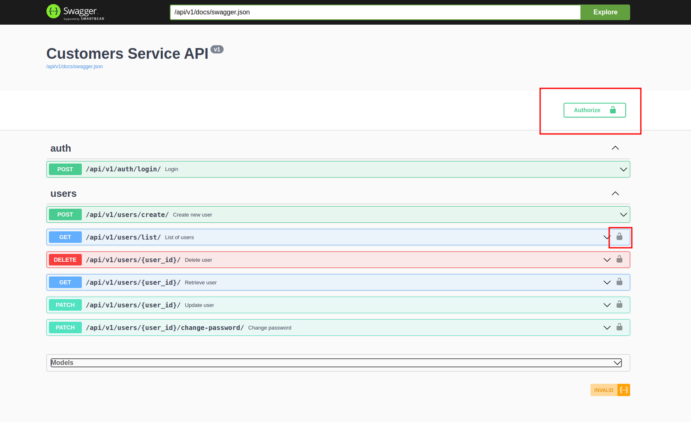
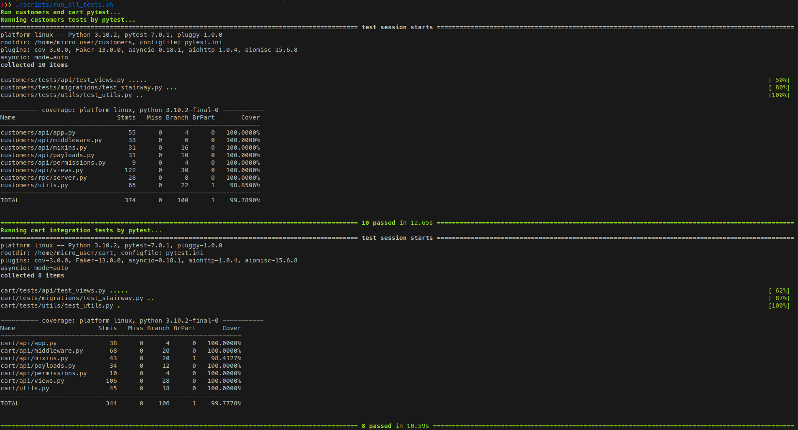

# microservices-cart-test
[](https://codecov.io/gh/Fl1p92/microservices-cart-test)


This project consists of two backend services, such as `customers` and `cart`, which demonstrate a partial 
implementation of an online store. Both services require a JWT token for user authorization in most part of API points.
`cart` service uses `customers` service for validation authentication data. Interservice communication is carried out
using synchronous communication pattern with gRPC framework. Despite having a REST API points which would have 
been enough for communication via HTTP I decided to use gRPC because I have a lot of requests in `cart` service
which needs to be validated in the `customers` service and the gRPC framework is generally more efficient than using
typical HTTP requests. gRPC is built on top of HTTP/2, which can make multiple requests in parallel on a long-lived 
connection in a thread-safe way. Connection setup is relatively slow, so doing it once and sharing the connection
across multiple requests saves time. gRPC messages are also binary and smaller than JSON. Further, 
HTTP/2 has built-in header compression.

The `customers` service provides the following functionality:
- the ability of registration (creation) and authorization of users;
- there is an administrative account that can retrieve all users list, change and delete any data
(user is marked as `is_admin = True`);
- the ability to retrieve and change user own account information, password or delete himself`*`;
- the ability to validate JWT token sent from `cart` service via gRPC.

*`*`only authenticated users or admins*

The `cart` service provides the following functionality:
- the ability to get a list of products with information about them (name, description, price);
- the ability to get user own cart information or create it, if it doesn't exist`*`;
- the ability to clear user own cart`*`;
- the ability to add product to user own cart, in other words - create cart-item object`*`;
- the ability to change the quantity of product in user own cart`*`;
- the ability to remove a product from user own cart`*`;
- the ability to send for validation JWT token to `customers` service via gRPC on each request.

*`*`only authenticated users or admins*

Each service has own database - PostgreSQL 13.5. Both services use the following packages:
- `aiohttp` for asynchronous HTTP Server;
- `sqlalchemy` for working with a database;
- `alembic` for managing database migrations;
- `asyncpg` as database driver (the fastest asynchronous driver for CPython);
- `aiohttp-apispec` with `marshmallow` for describe schemas tha are used for validation, serialize/deserialize data and
  generation Swagger Specification;
- `grpcio-tools` for gRPC Python tools;
- `pytest` for unit and integration testing;
- `factory-boy` for generate test data in tests;
- `flake8` for checking the code for errors and non-compliance with PEP8 standards;
- `pip-tools` for working with pip packages;
- and some others, please check out the requirements.in in each service

## To deploy this project, complete the following steps:

### 1. Development environment configuration
Create from templates and modify `.env` files (make sure you are in the `microservices-cart-test` folder):
```bash
# pwd
# /home/awesome_guy/projects/microservices-cart-test
cp .env.example .env && cp cart/.env.example cart/.env && cp customers/.env.example customers/.env
```
Set the `SYSTEM_USER` variable in root `.env` file for your user (run `id -u && id -g` in Unix).

### 2. Docker
To run services and databases containers just do (services images pushed to Docker Hub for ease of use):
```bash
docker-compose up -d
```
Or if you want to build images locally you need to create TLS certificates and run build script:
```bash
# pwd
# /home/awesome_guy/projects/microservices-cart-test
cp ca.key.example ca.key && cp ca.pem.example ca.pem
./scripts/build_all_images.sh
```

### 3. Run migrations
```bash
docker exec -it customers alembic -c customers/alembic.ini upgrade head
docker exec -it cart alembic -c cart/alembic.ini upgrade head
```
The project includes data migrations to fill databases with initial users and carts data.
Migration in `customers` service creates 2 admins (`admin1@email.com`, `admin2@email.com`) and 2 non-admins
(`nonadmin3@email.com`, `nonadmin4@email.com`). All users have the same password - `testPass123`.
Migration in `cart` service creates carts with cart items for these users.

### 4. Optional. Additional files
If you want to see python files generated from protobufs for gRPC and avoid IDE errors, just run:
```bash
# pwd
# /home/awesome_guy/projects/microservices-cart-test
docker cp customers:/home/micro_user/protobufs/ .
```
Also, you can get generated `requirements.txt` file for each service:

```bash
# pwd
# /home/awesome_guy/projects/microservices-cart-test
docker cp customers:/home/micro_user/requirements.txt ./customers/
docker cp cart:/home/micro_user/requirements.txt ./cart/
```

## Swagger Specification
In order to take advantage of the advantages of a swagger (such as auto-documentation and REST API client)
visit the following links:
- http://localhost:8081/api/v1/docs/ (where 8081 is `SERVICE_PORT` environment variable) for `customers` service;
- http://localhost:8082/api/v1/docs/ (where 8082 is `SERVICE_PORT` environment variable) for `cart` service.

To use most REST API points, you need a JWT token, which can be obtained from the following API point 
in `customers` service: http://localhost:8081/api/v1/auth/login/

Then you can put it in the swagger authorization interface (click the `Authorize` button or lock icon).
Use users previously created by data migration for everything you need.



## Run flake8 checking in both services
```bash
# pwd
# /home/awesome_guy/projects/microservices-cart-test
./scripts/run_flake8.sh
```

## Run pytests with coverage in both services
```bash
# pwd
# /home/awesome_guy/projects/microservices-cart-test
./scripts/run_all_tests.sh
```
Most part of `cart` services tests is integration test, which requires availability of `customers` service. Bash script
will check it availability before run pytest.
Example of pytest session:



## Stairway test
This cool method for testing migrations was borrowed from [alvassin](https://github.com/alvassin/alembic-quickstart).

### Info about stairway test
Simple and efficient method to check that migration does not have typos and rolls back all schema changes.
Does not require maintenance - you can add this test to your project once and forget about it.

In particular, test detects the data types, that were previously created by `upgrade()` method and were not removed
by `downgrade()`: when creating a table/column, Alembic automatically creates custom data types specified in columns
(e.g. enum), but does not delete them when deleting table or column - developer has to do it manually.

#### How it works
Test retrieves all migrations list, and for each migration executes `upgrade`, `downgrade`, `upgrade` Alembic commands.
See [test_stairway.py](customers/tests/migrations/test_stairway.py) for example.


